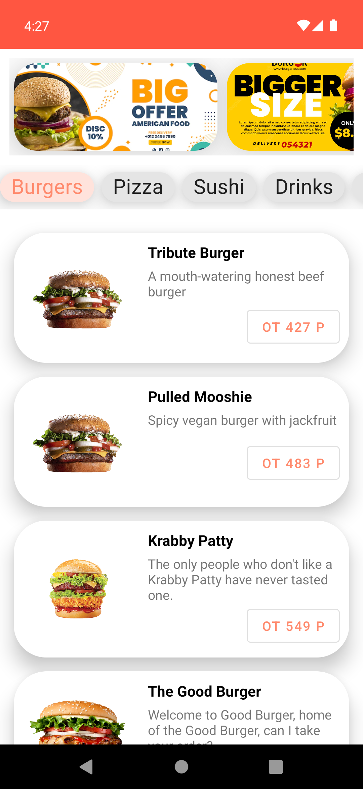

### Overview:
This a project for test task. Simple app for food ordering.

App takes burger names and description from the following [API](https://rapidapi.com/coltla/api/burgers1/).

Network request was implemented via [Retrofit](https://square.github.io/retrofit/) 

### Appearance:
</img>